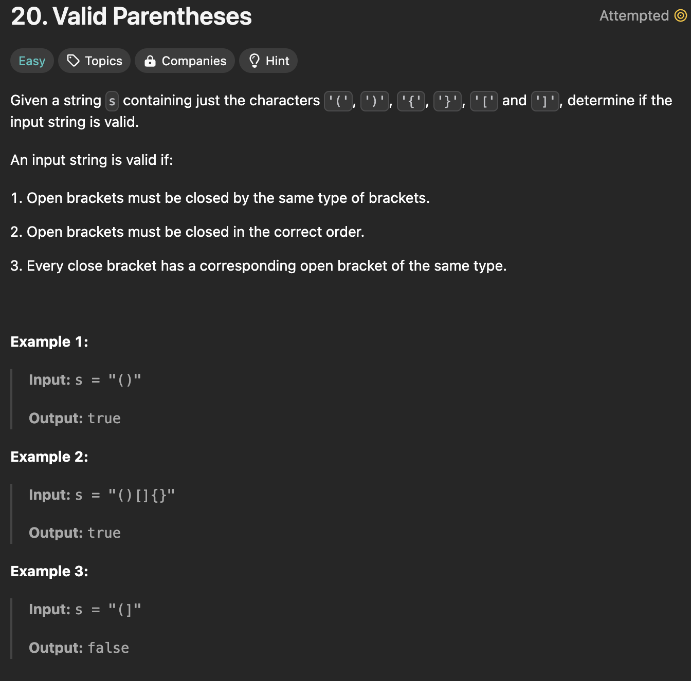

</img>
<h3>Небольшое вступление</h3>
Сегодня нет настроения писать документацию на английском языке, 
поэтому поупражняюсь в русском. Дорогие читатели, можете удостовериться, 
что все таки пишу на английском я сам, а не перевожу.
Хотя, искушенный пользователь поймет это сразу, по ошибкам в английском :)

<h1>Объяснение задачи и мои мысли по решению.</h1>
На ум сразу же приходит реализовать стек - главный его принцип
LIFO. Можно представить на его месте принглс. Мы сможем достать последнюю чипсинку
первой. Первую же чипсинку мы сможем достать только последней.

Стек будет заполнен половиной строки, соответственно 
нам нужно, чтобы строка всегда была четной длины.
В случае, если строка будет нечетной длины - функция вернет
false без дополнительных проверок.

Моя теория оказалась не совсем правильной. При тестовых данных, например:
"()[]{}" мой алгоритм не работает.
